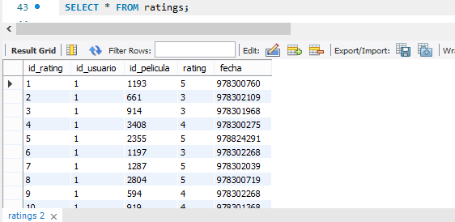

# Sesión 7_ BEDU: Configuración de Bases de Datos locales.
### :wrench: MySQL.
Para la configuración de la base de datos en una instancia local  de MySQL es necesario descargar MySQL Server y posteriormente conectarse como se realizó en la sesión 1 del curso. Al tratarse de una base de datos relacional se puede tener el uso de diagramas **entidad-relación** de tal forma que se modelan las tablas de la BD y la relación entre ellas. Mediante estos diagramas es posible detectar los *tipos de relaciones* que hay entre ellas, esto es las llaves primarias (PK) que almacenará.Además podemos alnalizar el número y tipo de campos que contendrá cada tabla. 
### :wrench: MongoDB. 
A diferencia de MySQL, para la insersión de registros en MongoDB no es necesaria la creación de la estructura previa de la BD pues como tal dicho concepto no existe en la BD no relacional. 

En ambos casos, tanto en MongoDB como en MYSQL el formato en el cual se importan las BD es en **.csv** verificando previamente que la estructura sea la correcta. De tal forma que previamente ya establecimos el formato separado por "," para delimitar los campos.  

## :pushpin: Reto 1. Realizando operaciones con tablas.
1. Definir los campos y tipos de datos para la tabla `movies` haciendo uso de los archivos `movies.dat` y `README`.

2. Crear la tabla `movies` (recuerda usar el mismo nombre del archivo sin la extensión para vincular nombres de tablas con archivos).

3. Definir los campos y tipos de datos para la tabla `ratings` haciendo uso de los archivos `ratings.dat` y `README`.

4. Crear la tabla `ratings` (recuerda usar el mismo nombre del archivo sin la extensión para vincular nombres de tablas con archivos).

#### NOTA: Los archivos .csv utilizados se encuentran en datos_csv.zip.

## :pushpin: Reto 2. Importando datos a una tabla en formato CSV.

1. Usando como base el archivo `movies.dat`, limpiarlo e importar los datos en la tabla `movies` creada en el Reto 1.

En el caso de movies hay que primero buscar las "," en el titulo de la película y remplazarlo con un editor de texto por "-", adicionalmente también modifique "|" por "-" y finalmente "::" por "," para delimitar los campos.

2. Usando como base el archivo `ratings.dat`, limpiarlo e importar los datos en la tabla `ratings` creada en el Reto 1.

Para este caso fue más sencillo puesto que únicamente se remplazó "::" por "," para delimitar los campos. 

## :pushpin: Reto 3. Importando datos a MongoDB.
Después de crear la nueva DATABASE: Carolina_BEDU, se generan las colecciones users, movies y ratings . Finalmente se importan las bases de datos en formato .csv . 

